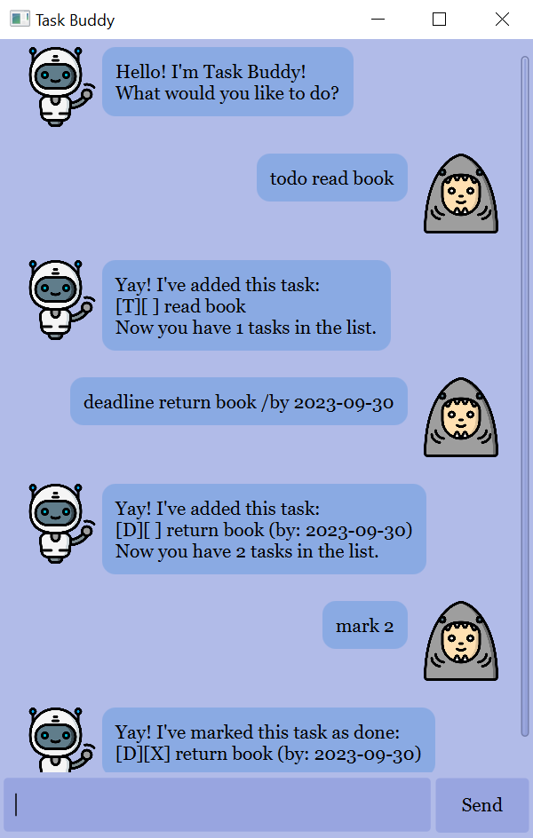

# Task Buddy User Guide

Need help keeping track of your different tasks? Task Buddy is here to help!


## Getting Started
1. Ensure you have Java 11 or above installed in your computer.
2. Download the jar file from [here](https://github.com/miljyy/ip/releases).
3. Run the jar file using the `java -jar buddy.jar` command.

## Features
Here is a handy overview of the features that Task Buddy offers, for your easy reference 
any time you need it!

|   Feature   | Description                                                               |
|:-----------:|:--------------------------------------------------------------------------|
|  Add task   | Adds a task to the list.<br/>Tasks can be todo, deadline, or event tasks. |
| Delete task | Deletes a task from the list.                                             |
|  Mark task  | Marks a task in the list as done.                                         |
| Unmark task | Marks a task in the list as undone.                                       |
| List tasks  | Lists all the tasks currently in the list.                                |
|  Find task  | Finds a task from the list using matching keyword(s).                     |
| Update task | Updates the specified field of a task.                                    |
|  Find task  | Ends the current session with Task Buddy.                                 |


## Usage
**Notes regarding the task types:**
* **Todo** : tasks with just a description
* **Deadline** : tasks with a description and a due date
* **Event** : tasks with a start and end date

**Notes regarding the command format:**
* Words in `<>` are _parameters_ to be supplied by user input.
  * For example, `<TASK_DESCRIPTION>` in `todo <TASK_DESCRIPTION>` command is a parameter which can be input as
    `todo assignment 1`.

### `todo` - Adds a new Todo Task

> Format: `todo <TASK_DESCRIPTION>`

Example of usage: 
`todo read book`

Expected outcome:
```
Got it. I've added this task:
[T][] read book
Now you have 1 task in the list.
```


### `deadline` - Adds a new Deadline Task

> Format: `deadline <TASK_DESCRIPTION> /by <TASK_DEADLINE>`
> * `TASK_DEADLINE` should be in yyyy-mm-dd format (e.g. 2023-12-12).

Example of usage:
`deadline return book /by 2023-09-30`

Expected outcome:
```
Got it. I've added this task:
[D][] return book (by: 2023-09-30)
Now you have 2 tasks in the list.
```


### `event` - Adds a new Event Task

> Format: `event <TASK_DESCRIPTION> /from <TASK_START> /to <TASK_END>`
> * `TASK_START` and `TASK_END` should be in yyyy-mm-dd format (e.g. 2023-12-12).

Example of usage:
`event holiday /from 2023-12-03 /to 2023-12-12`

Expected outcome:
```
Got it. I've added this task:
[E][] holiday (from: 2023-12-03 to: 2023-12-12)
Now you have 3 tasks in the list.
```


### `delete` - Deletes a Task from the TaskList

> Format: `delete <TASK_INDEX>`
> * `TASK_INDEX` should be a positive integer (e.g. 1,2,3,...).

Example of usage:
`delete 3`

Expected outcome:
```
Noted. I've removed this task:
[E][] holiday (from: 2023-12-03 to: 2023-12-12)
Now you have 2 tasks in the list.
```


### `mark` - Marks a task as done.

> Format: `mark <TASK_INDEX>`
> * `TASK_INDEX` should be a positive integer (e.g. 1,2,3,...).

Example of usage:
`mark 1`

Expected outcome:
```
NICE! I've marked this task as done:
[T][X] read book
```


### `unmark` - Marks a task as not done.

> Format: `unmark <TASK_INDEX>`
> * `TASK_INDEX` should be a positive integer (e.g. 1,2,3,...).

Example of usage:
`unmark 1`

Expected outcome:
```
OK, I've marked this task as not done yet:
[T][] read book
```


### `list` - Lists all the tasks in the TaskList

> Format: `list`

Example of usage:
`list`

Expected outcome:
```
Here are the tasks in your list:
1. [T][] read book
2. [D][] return book (by: 2023-09-30)
```


### `find` - Finds matching tasks in the TaskList

> Format: `find <KEYWORD>`
> * `KEYWORD` should be in alphanumeric format.

Example of usage:
`find return book`

Expected outcome:
```
Here are the tasks in your list:
1. [D][] return book (by: 2023-09-30)
```


### `update` - Updates a Task in the TaskList

> Format: `update <TASK_INDEX> /<FIELD_TO_UPDATE> <NEW_DESCRIPTION>`
> * `TASK_INDEX` should be a single number (e.g. 1,3,10,etc.).
> * To update task description:
  >   * `FIELD_TO_UPDATE` should be `desc`.
  >   * `NEW_DESCRIPTION` should be new description of task
> * To update task date:
>     * `FIELD_TO_UPDATE` should be either `by`,`from` or `to`, depending on task type.
>     * `NEW_DESCRIPTION` should be in yyyy-mm-dd format (e.g. 2023-12-12).

Example of usage:
`update 1 /desc borrow 2 books`,
`update 2 /by 2023-10-03`

Expected outcome:
```
Noted. I've updated this task to:
[T][] borrow 2 books
```

```
Noted. I've updated this task to:
[D][] return book (by: 2023-10-03)
```


### `exit` - Ends the current session with Task Buddy

Format: `bye`

Example of usage:
`bye`

Expected outcome:

```
Bye. Hope to see you again soon!
```
